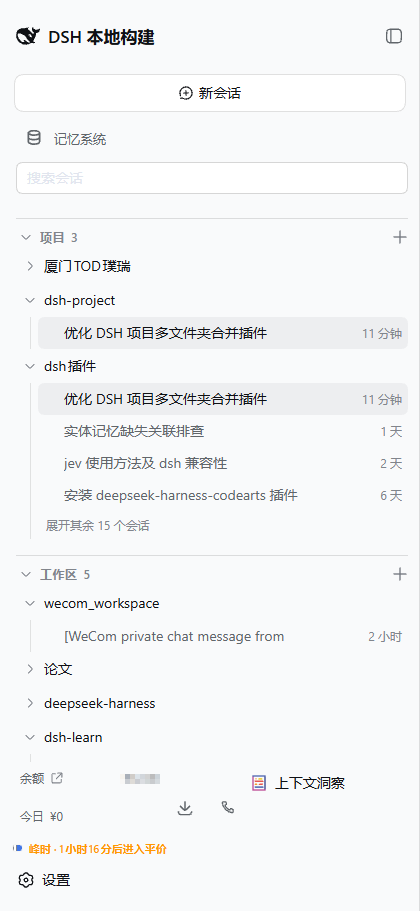

# dsh-loom

[中文](../README.md) | English

<p>
  <a href="https://github.com/fryghost/dsh-loom/actions/workflows/ci.yml"></a>
  <a href="../LICENSE"></a>
</p>

**Weave several folders into one DSH project context — and, before the session starts, see exactly what it is going to load.**



DSH is a *harness* (reins, or a mounting frame), and the harness of a loom is precisely the part that controls the warp threads. What Loom does is weave: it draws the warp threads of several folders into one session context.

---

## What it solves

Natively, a DSH session knows exactly one working directory (`SessionHeader.cwd`), and skill discovery, `AGENTS.md`, and the sandbox write boundary all hang off it. So "one project spanning several folders" cannot be built out of UI grouping.

The existing `dsh-projects` tried, but it has three structural problems:

1. **Skills are discovered from a single project root only** — a sub-folder's skills can never get in;
2. **A folder cannot belong to more than one project**, and on a conflict it **silently drops the whole group**;
3. **The primary/secondary folder split** pins the cwd of a new session to the primary folder.

Loom is not a copy of it but a different implementation route: **do not change the cwd; add a skill provider plus a previewable context preflight.**

## Three highlights

### Highlight 1: Context Preflight

This is the reason Loom exists. The hardest thing about a multi-folder project is not the "merge" — it is that **you cannot see the result of the merge**. So Loom puts the answer on the table before the session starts:

```
项目：厦门TOD璞瑞（3 个文件夹）
活动文件夹：ws-a

技能（4）
  · tod-dimension-chain ← ws-a
  · tod-read-image      ← ws-a
  · pdf-xref-recover    ← ws-b

名称冲突（1）
  ! render-plan
      生效：ws-a
      被遮蔽：ws-b

指令文件（2，共 8421 字节）
  · ws-a — D:/project/装修/AGENTS.md（6100 字节）
  · ws-b — D:/project/资料/AGENTS.md（2321 字节）

写入范围：仅活动文件夹可写；其他成员可读，但写入会被沙箱拒绝（DSH 的写入边界由单个 workspaceRoot 推导）。

未贡献的文件夹（1）
  · ws-c：该文件夹没有提供任何技能（未找到 .dsh/skills 或 .agents/skills，或目录为空）。
```

The point is that **every "did not take effect" carries a named reason**. If the `ws-c` above said nothing at all, the user would be left thinking "why aren't my skills loading" — which is exactly the hardest thing to diagnose in a primary/secondary folder design.

### Highlight 2: a folder can belong to several projects at once

The data model is genuinely many-to-many, with no `claimed` exclusive set:

```jsonc
{
  "schemaVersion": 2,
  "projects": [
    { "id": "p1", "title": "装修",   "members": [{ "workspaceId": "ws-shared", "role": "writable" }] },
    { "id": "p2", "title": "资料库", "members": [{ "workspaceId": "ws-shared", "role": "readonly" }] }
  ]
}
```

The same folder is both a writable member of "装修" and a read-only member of "资料库". `role` describes **what it contributes**, not where it ranks.

### Highlight 3: a conflict is visible, not a silent win

When a skill of the same name appears in several folders, Loom **always reports it**: who is active and who is shadowed. This is not a log line; it is ordinary content in the UI.

## Key differences from dsh-projects

| | dsh-projects v0.3 | dsh-loom |
|---|---|---|
| Folder ownership | Exclusive; on conflict the whole group is silently dropped | Many-to-many; never dropped |
| Single-member projects | Illegal (`length < 2` is dropped) | Legal |
| Member unreachable | Silently disappears | Kept and marked `unresolved` |
| Primary/secondary split | Exists, and decides the cwd | None; only a "default starting point" preference |
| Sub-folder skills | Invisible | **Visible** (registers a skill provider) |
| Grouping storage | Browser localStorage | `$DSH_HOME/projects/manifest.json` |
| Desktop/Web | Not shared | Share the same file |
| Pre-session visibility | None | **Context preflight** |
| Write boundary | Unstated | Stated explicitly |

## Installation

DSH plugins are installed per **profile**. Desktop and Web are two separate profiles and must be installed separately:

| What you are using | `--profile` |
|---|---|
| DSH Web UI in a browser | `web` |
| The DSH Desktop app | `desktop` |

### Install from GitHub (recommended)

```bash
dsh plugin --profile web add github:fryghost/dsh-loom
```

No clone and no build: the client half `dist/client.js` is committed with the repository.

### Install from a local checkout (for development)

Clone first, then use an **absolute path**:

```bash
git clone https://github.com/fryghost/dsh-loom.git
cd dsh-loom
dsh plugin --profile web add link:/absolute/path/to/dsh-loom
```

On Windows the absolute path has to be written in Windows form (forward slashes or doubled backslashes):

```powershell
dsh plugin --profile web add link:C:/path/to/dsh-loom
```

### Restart

After installing, **fully quit and restart** the matching profile; only then does the new plugin mount.

### How to confirm it is installed

`dsh plugin` writes the plugin into two places in the profile's `package.json`: a dependency appears under `dependencies`, and because Loom declares `dsh.bundle.patch` it is also added to `dsh.profile.bundles` as one layer.

```bash
# Windows
notepad %USERPROFILE%\.dsh\profiles\web\package.json
# macOS / Linux
cat ~/.dsh/profiles/web/package.json
```

`"dsh-loom"` should appear in `dsh.profile.bundles`. If it only appears under `dependencies` and never made it into `bundles`, the package's `dsh.bundle` was not recognized — the plugin will not mount.

### Uninstall

```bash
dsh plugin --profile web remove dsh-loom
```

This removes it from both `dependencies` and `dsh.profile.bundles`. The project manifest `$DSH_HOME/projects/manifest.json` **is not deleted** (it is your data).

## How to use it

Loom takes over the sidebar's browse area and splits it into three sections. **A session appears in exactly one section** — never duplicated, never missing:

```
▾ 项目  3                                  +
  ▾ 厦门TOD璞瑞                    ⋯
        核对尺寸并推进渲染图      12 小时
  ▾ dsh-project
        优化 DSH 项目多文件夹合并插件  11 分钟
▾ 工作区  5                                +
  ▾ wecom_workspace                ⋯
        [WeCom private chat message…    2 小时
▾ 聊天  4
      [WeCom private chat message…      15 天
```

> This block is a **structural sketch**; its counts do not match the real screenshot above (there, 厦门TOD璞瑞 is collapsed and the Chats section sits below the fold). The screenshot is the real thing.

| Section | Which sessions it takes |
|---|---|
| **Projects** | Sessions under a project's member folders (deduplicated when several members match the same session) |
| **Workspaces** | Sessions of workspaces not claimed by any project |
| **Chats** | Sessions whose cwd matches no *registered* workspace |

### Why "Chats" is not an empty section

A session always has a cwd, but **belonging to a workspace is a live fact, not a stored guarantee**. DSH defines membership as:

> The record's ordered `sessionIds` is the ownership truth; `sessionIds` filters on read — `sessionIds.filter(id => sessionPath(id) === record.path)`

(`packages/workspace/workspace/src/entity.ts:101-102`; that package's README calls it "membership is ownership plus a live cwd fact".)

So attribution holds only while **a registered workspace exists whose path equals that session's cwd**. When that stops being true, no workspace claims the session:

- **The workspace registration was deleted** — DSH's `delete` explicitly removes the registration only and **does not delete session logs**, leaving those sessions unowned;
- **The cwd no longer matches any registered path** — for instance the folder was moved or renamed.

Such sessions cannot enter Projects (whose members are all workspaces) or Workspaces, so they land in Chats. **It is the destination for "unowned", not for "temporary".**

Archived sessions appear in none of the three sections; **subagent sessions are not sessions here** — they hang under the parent session's header directory and are not part of this list.

**The same session may appear once under each of several projects, and that is deliberate.** If a folder belongs to two projects at once, its sessions are listed under both — because that folder really does belong to both. Deduplication happens only **between the members of one project** (when two members match the same session, it is listed once).

The `优化 DSH 项目多文件夹合并插件` in the screenshot above is exactly this: both `dsh-project` and `dsh 插件` count it as a member, so it appears in both places. "Unique attribution" means **no duplication across the three sections**, not "every session appears exactly once globally" — the latter is impossible in this data model, and should not be done anyway.

### Common actions

| What you want to do | How |
|---|---|
| Create a project | The `+` on the right of the **Projects** section |
| Change project members / starting folder | The project row's `⋯` → Edit. **A folder can belong to several projects at once** |
| Expand every session of one project | Click the group name, or "Show N more" (4 rows by default) |
| Start a new chat in a folder | The group row's `+` |
| **See what this project will actually load** | The project row's `⋯` → **Context preflight** |
| Rename / fork / archive a session | The session row's `⋯` |
| Create / rename / delete a workspace | The `+` on the right of the **Workspaces** section; the workspace row's `⋯` |
| Collapse a whole section | Click the section title |
| Search | The search box at the top; matches session titles and group names together |

Deleting a workspace **removes only the registration**: it deletes no folder and no session log. Deleting a project removes only the grouping, for the same reason.

### What the starting folder is

A project can name a "default starting point" — a new chat session starts there. It is **a preference, not a rank**: it gives that folder no priority in skill discovery. Multi-folder aggregation treats every member alike, and conflicts are settled by role and declaration order (see the [design notes](design.md)).

## Data and safety

- Project manifest: `$DSH_HOME/projects/manifest.json`, **written atomically** (temp file + rename).
- A corrupted manifest **is not overwritten**: when reading fails, the original file is kept and reported, and the user decides what to do with it.
- A manifest from a newer version **refuses to be interpreted**, so downgrading is safe.
- Uninstalling deletes no folders, sessions, or manifest files.
- The RPC channel accepts loopback callers only.

## Known boundary: writing across folders

DSH's `SandboxExecutionPolicy.workspaceRoot` is **a single string**, and `writableRoots()` yields only `[workspaceRoot, /tmp, tmpdir()]`. Therefore:

| Sandbox mode | Read | Write |
|---|---|---|
| `danger-full-access` | All members | All members |
| `workspace-write` | All members | **The active folder only** |
| `read-only` | All members | None |

**Reads are not fenced by the sandbox** (`fs-sandbox` only fences `writeText`/`editText`), so cross-folder aggregation of skills and instructions holds in every mode; only writing is restricted.

### Why not sidestep it with symlinks/junctions

A natural idea: build an aggregate directory whose symlinks point at the members. **Measured conclusion: symlinks cover only part of it, and the part that is hardest to maintain.**

What hangs off `cwd` in DSH is not one subsystem but **seven**, and they react to symlinks differently:

| Subsystem | Can symlinks aggregate it |
|---|---|
| Skill discovery | Partial — only "one link per skill" works |
| `AGENTS.md` | Partial — only "a link to the whole file" works (it **replaces**; it cannot merge) |
| `@` file reference index | No — **rejects symlinks outright** |
| `grep` / `glob` | No — ripgrep does not follow by default (no `--follow` in argv) |
| Sandbox write boundary | No — the dev+ino check fails |
| bash / pwsh workdir | No — inherits the single cwd |
| LSP workspaceRoot | No — single root |

Key measurements (`test/dsh-baseline.test.js` pins them as 9 tests):

| Layout | Result |
|---|---|
| `A/b` → a link to folder `B` | No — **aggregates nothing at all**; it reads only the two fixed paths `.dsh/skills` and `.agents/skills` |
| `A/.dsh/skills` itself linked to `B/.dsh/skills` | No — **substitutes instead of aggregating**; a symlink has only one target, and A's skills are gone |
| A link **per skill** inside `A/.dsh/skills/` | Yes — it aggregates, but every one is maintained by hand |
| `A/AGENTS.md` → a link to `B/AGENTS.md` | Partial — it loads, but it can only **replace**; the two instruction files cannot be merged |
| **Writing** through a link | No — refused under `workspace-write` (reading works) |

**The easiest trap to fall into**: being able to `cat` a file ≠ DSH being able to find it. Neither the `@` reference index nor `grep`/`glob` follows symlinks — the former **actively rejects** them with `lstat` at `search.ts:275`, and the latter's ripgrep argv has no `--follow`. Measured with real ripgrep 15.2.0: with and without `--follow`, the match count goes from 1 to 2.

**One level deeper**: DSH does not ignore symlinks — it **deliberately makes symlinks converge identity and blocks escape**. `containment.ts:58-75` compares **device + inode** along the ancestor chain; when the cwd is an aggregate root, the members' realpath walk up never meets the aggregate root's inode, so the write is necessarily refused. That is, "**DSH considered symlinks, and therefore explicitly does not support symlinks as multiple roots**". See the [design notes](design.md#30-前置事实不装插件时软链接能聚合到哪一步).

### If upstream fixes it, the cost is smaller than it looks

`writableRoots()` **already returns an array**, and its consumers (the fs fence, the Seatbelt profile) **are already multi-root loops**. So on the POSIX side it is enough to add an `additionalRoots` to the policy and merge.

The real friction is concentrated in **Windows ACLs**: `workspace-sid.ts` is designed on the premise of "one write SID per workspace, one ACE propagation". Multiple roots mean N SIDs, N propagations and N cleanups. bwrap / Landlock each have their own grant spelling to line up as well.

Loom does not take it upon itself to bypass the security boundary, but this upstream path has a clearly better benefit/cost ratio than the first estimate suggested, and it deserves an RFC of its own. See the [design notes](design.md#22-暂不做但比原先估计的小得多扩展沙箱为多根).

### Known defect: the preflight text is Chinese only

The client UI is bilingual — `dictionaries` in `src/client.cjs` carries both `zh` and `en`. **But the text inside the context preflight is hardcoded Chinese**, so an English UI shows Chinese sentences wrapped in English labels.

The source is on the host side: `src/core/context-plan.cjs` emits **finished sentences** instead of structured data — the write-boundary wording (`describeWriteBoundary`, lines 62/70/77/84), the reasons a member contributes nothing (lines 127/170/196), and the whole text report (`formatContextPlan`).

This is a design problem rather than a missing translation: **a pure function should not produce prose in one language.** The correct fix is for it to return descriptors — mode, writable members, reason keys — and let the client render them from its own dictionary. It is **not fixed here**: doing it properly means changing the core, the client rendering and the tests together, and shipping an unverified half of it would be worse than leaving it stated.

## Architecture

```
Host (src/index.js)                     纯 Node，不依赖浏览器
├── host/manifest-store.js   $DSH_HOME 原子读写 + schema 版本守卫
├── host/skill-provider.js   ctx.skills.registerProvider —— 让兄弟文件夹贡献技能
└── RPC /dsh-loom            getManifest / putManifest / preflight / report（loopback）

Client (src/client.cjs)                 只贡献一个槽位
├── LoomSidebarHost          侧边栏浏览器：项目 / 工作区 / 聊天
├── LoomSidebar              三段树 + 搜索
├── SessionRow / LoomGroup   会话行（重命名/分支/归档）与组行
├── ProjectEditor            文件夹多归属编辑（无独占、无主副）
├── PreflightModal           上下文预检
└── RowMenu                  统一的行内省略号菜单

src/core/*.cjs                          纯函数，脱离 DSH 与浏览器即可测试
├── manifest.cjs             schema 校验与迁移
├── skill-roots.cjs          成员 → 技能根 / 指令候选
├── frontmatter.cjs          SKILL.md 元信息解析（含 CRLF）
├── context-plan.cjs         预检计划：来源、冲突、静默文件夹、写入边界
└── sections.cjs             三段归属（唯一归属）与可见性规则
```

## How it plugs into the UI

Loom **registers exactly one slot**: `sidebar.workspaces`, `priority: -100`. That seat is the sidebar's browse region, and taking it replaces the shipped workspace browser — **this time it is the right thing to do**, because the three sections **include** the native workspace grouping.

It does **not register** `sidebar.panellist`, and does **not register** `main`:

- The project list is already fully covered by the sidebar's **Projects** section, and a separate panel would only duplicate it;
- and the cost of `sidebar.panellist` is **a permanent row in the global navigation** — it applies to every session, including the ones with nothing to do with projects.

The only thing a panel could do that the sidebar cannot is the context preflight, and that is **an action on one specific project**, so it opens from that project's own row menu.

Both of these are pinned by tests (`test/client-contract.test.cjs`): if anyone adds `sidebar.panellist`/`main` back, or changes the three sections so that they no longer include the native grouping, the tests fail.

### The design of the three-section tree

The hierarchy is distinguished by **static signals**, not by hover changes:

| Level | Font size | Color | Leading glyph |
|---|---|---|---|
| Section title (with a divider) | 12px / 600 + letter-spacing | `label-tertiary` | triangle |
| Group row | 14px / 500 | `label-primary` | triangle (16px slot) |
| Session row | 14px / 400 | `label-secondary` | state dot |

**There are only three font sizes: 12 / 14 / 16** (16 comes with the `Modal` atom), taken from the native DSH sidebar's scale.

**Deliberately no hover glyph swap** (icon ↔ triangle): the glyph jumps as the pointer enters and leaves, and at exactly the moment you are trying to aim at it, "what is this" and "is it collapsed" both become uncertain. **A static glyph is worth more than one glyph that says two things.** This too is written into `test/client-contract.test.cjs`.

### The UI is built directly on DSH's design system

The client writes no buttons, tags, state dots or dialogs of its own; it requires the platform module `@deepseek-ai/dsh-client-ui-primitives` — **the same set of atoms the shipped UI uses**:

| Purpose | Atom |
|---|---|
| Every button | `Button` (pill r18, h36 / compact h28) |
| Counts / roles / unreachable markers | `Tag` (11px read-only pill, tone chosen by semantics) |
| Member state | `StateDot` (done/warning/ongoing/error/idle) |
| Dialogs (edit / preflight / rename) | `Modal` (r24 + blurred scrim, Esc to close built in) |
| Text input | `Input` |
| Row menus | `Menu` (anchored + portal) |

This one was bought at a price: the first version hand-wrote buttons and badges with 8px rectangular corners and 13px text, while DSH's language is **14px/22px body + pill buttons at r18/h36 + 0.5px hairline borders + r24 dialogs**, so that version looked like a control from somewhere else.

Because it is in `PLATFORM_MODULES`, keeping it external at build time is enough to share the host's single instance and its already-loaded styles, instead of bundling a second copy. `test/client-contract.test.cjs` locks that down as well: **if anyone goes back to hand-written controls, the tests fail**.

### One scoped `box-sizing` reset

`.loom-sidebar` and all of its descendants are forced to `box-sizing: border-box`.

This is not fastidiousness: under `content-box`, `width: 100%` resolves against the content box, so any element that also has padding comes out **wider than its container**. That omission produced three visible failures one after another — the search field overflowed, the project-name input sat on top of the list beneath it, and every session row was 12px too wide, pushing the timestamps off the right edge and giving the whole column a horizontal scrollbar. **Patching it element by element is what let it come back**, so it became a single scoped reset.

## Development

```bash
npm install
npm run verify   # check + build + test
```

### If you change `src/client.cjs`, remember to rebuild

`dist/client.js` is a build artifact **committed with the repository** (so that `dsh plugin add` needs no build). After changing `src/client.cjs` you must rebuild and commit it together:

```bash
npm run build
git add dist/client.js
```

A CI job guards this line specifically (`bundle-freshness`): it rebuilds and compares with `git diff --exit-code dist/client.js`, and a stale artifact fails it outright.

## Tests

```bash
npm test
```

Of these, `test/dsh-baseline.test.js` pins the behaviour of **DSH itself** (whether symlinks can aggregate, whether `@` references reject symlinks, and so on), not Loom's behaviour. It needs a DSH source checkout, named through the `DSH_CHECKOUT` environment variable; when it cannot be found, those cases **skip rather than fail**:

```bash
DSH_CHECKOUT=/path/to/deepseek-harness npm test
```

## Documentation

- [Design notes](design.md) — why it is designed this way, the source evidence, the rejected options
- [Migration guide](migration.md) — migrating from dsh-projects

## License

MIT
