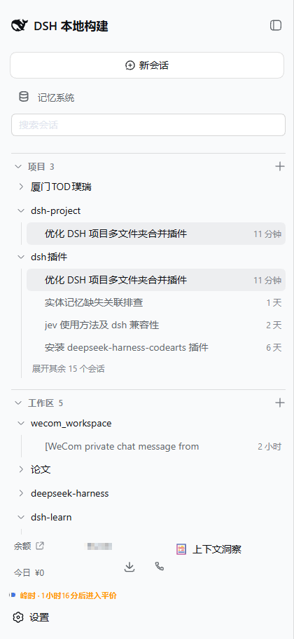

# dsh-loom

[中文](../README.md) | English

<p>
  <a href="https://github.com/fryghost/dsh-loom/actions/workflows/ci.yml"></a>
  <a href="../LICENSE"></a>
</p>

**Weave several folders into one DSH project context — and, before the session starts, see exactly what it is going to load.**



DSH is a *harness* (reins, or a mounting frame), and the harness of a loom is precisely the part that controls the warp threads. What Loom does is weave: it draws the warp threads of several folders into one session context.

---

## What it solves

Natively, a DSH session knows exactly one working directory (`SessionHeader.cwd`), and skill discovery, `AGENTS.md`, and the sandbox write boundary all hang off it. So "one project spanning several folders" cannot be built out of UI grouping.

The existing `dsh-projects` tried, but it has three structural problems:

1. **Skills are discovered from a single project root only** — a sub-folder's skills can never get in;
2. **A folder cannot belong to more than one project**, and on a conflict it **silently drops the whole group**;
3. **The primary/secondary folder split** pins the cwd of a new session to the primary folder.

Loom is not a copy of it but a different implementation route: **do not change the cwd; add a skill provider plus a previewable context preflight.**

## Three highlights

### Highlight 1: Context Preflight

This is the reason Loom exists. The hardest thing about a multi-folder project is not the "merge" — it is that **you cannot see the result of the merge**. So Loom puts the answer on the table before the session starts:

```
项目：example-project（3 个文件夹）
活动文件夹：ws-a

技能（3）
  · alpha-skill  ← ws-a
  · beta-skill   ← ws-a
  · gamma-skill  ← ws-b

名称冲突（1）
  ! shared-skill
      生效：ws-a
      被遮蔽：ws-b

指令文件（2，共 8421 字节）
  · ws-a — /repo/app/AGENTS.md（6100 字节）
  · ws-b — /repo/docs/AGENTS.md（2321 字节）

写入范围：仅活动文件夹可写；其他成员可读，但写入会被沙箱拒绝（DSH 的写入边界由单个 workspaceRoot 推导）。

未贡献的文件夹（1）
  · ws-c：该文件夹没有提供任何技能（未找到 .dsh/skills 或 .agents/skills，或目录为空）。
```

The point is that **every "did not take effect" carries a named reason**. If the `ws-c` above said nothing at all, the user would be left thinking "why aren't my skills loading" — which is exactly the hardest thing to diagnose in a primary/secondary folder design.

### Highlight 2: a folder can belong to several projects at once

The data model is genuinely many-to-many, with no `claimed` exclusive set:

```jsonc
{
  "schemaVersion": 2,
  "projects": [
    { "id": "p1", "title": "app",  "members": [{ "workspaceId": "ws-shared", "role": "writable" }] },
    { "id": "p2", "title": "docs", "members": [{ "workspaceId": "ws-shared", "role": "readonly" }] }
  ]
}
```

The same folder is both a writable member of "app" and a read-only member of "docs". `role` describes **what it contributes**, not where it ranks.

### Highlight 3: a conflict is visible, not a silent win

When a skill of the same name appears in several folders, Loom **always reports it**: who is active and who is shadowed. This is not a log line; it is ordinary content in the UI.

## Key differences from dsh-projects

| | dsh-projects v0.3 | dsh-loom |
|---|---|---|
| Folder ownership | Exclusive; on conflict the whole group is silently dropped | Many-to-many; never dropped |
| Single-member projects | Illegal (`length < 2` is dropped) | Legal |
| Member unreachable | Silently disappears | Kept and marked `unresolved` |
| Primary/secondary split | Exists, and decides the cwd | None; only a "default starting point" preference |
| Sub-folder skills | Invisible | **Visible** (registers a skill provider) |
| Grouping storage | Browser localStorage | `$DSH_HOME/projects/manifest.json` |
| Desktop/Web | Not shared | Share the same file |
| Pre-session visibility | None | **Context preflight** |
| Write boundary | Unstated | Stated explicitly |

## Installation

Requires **DSH 0.2 or newer**. The 0.1 private RPC channel (`connection.rpc.handle`) cannot mount on 0.2: the service resolves `webServer` up **Connection's own fiber**, a sibling plugin cannot satisfy that lookup, and the plugin throws `cannot get property "webServer" without inject` while loading. Since 0.2.3 Loom registers exact Fetch routes on the `/api` channel instead — see [Security](SECURITY.md) and the [changelog](CHANGELOG.md).

DSH plugins are installed per **profile**. Desktop and Web are two separate profiles and must be installed separately:

| What you are using | `--profile` |
|---|---|
| DSH Web UI in a browser | `web` |
| The DSH Desktop app | `desktop` |

### Install from GitHub (recommended)

```bash
dsh plugin --profile web add github:fryghost/dsh-loom
```

No clone and no build: the client half `dist/client.js` is committed with the repository.

### Install from a local checkout (for development)

Clone first, then use an **absolute path**:

```bash
git clone https://github.com/fryghost/dsh-loom.git
cd dsh-loom
dsh plugin --profile web add link:/absolute/path/to/dsh-loom
```

On Windows the absolute path has to be written in Windows form (forward slashes or doubled backslashes):

```powershell
dsh plugin --profile web add link:C:/path/to/dsh-loom
```

### Restart

After installing, **fully quit and restart** the matching profile; only then does the new plugin mount.

### How to confirm it is installed

`dsh plugin` writes the plugin into two places in the profile's `package.json`: a dependency appears under `dependencies`, and because Loom declares `dsh.bundle.patch` it is also added to `dsh.profile.bundles` as one layer.

```bash
# Windows
notepad %USERPROFILE%\.dsh\profiles\web\package.json
# macOS / Linux
cat ~/.dsh/profiles/web/package.json
```

`"dsh-loom"` should appear in `dsh.profile.bundles`. If it only appears under `dependencies` and never made it into `bundles`, the package's `dsh.bundle` was not recognized — the plugin will not mount.

### Upgrade

A `github:` install pins the **exact commit** into the profile's `pnpm-lock.yaml`, so reinstalling does not pick up new commits on its own. To move to the latest:

```bash
dsh plugin --profile web add github:fryghost/dsh-loom
```

That re-resolves the remote and refreshes the commit in the lockfile. Then **fully restart** the profile.

To see which version you are on:

```bash
# the package version
node -p "require(process.env.USERPROFILE + '/.dsh/profiles/web/node_modules/dsh-loom/package.json').version"
# or the commit the lockfile pinned
grep -A1 'dsh-loom' ~/.dsh/profiles/web/pnpm-lock.yaml | grep codeload
```

Every released version carries a git tag (`v0.2.6` and friends), so you can tell how far behind you are:

```bash
git ls-remote --tags https://github.com/fryghost/dsh-loom.git
```

A `link:` install is not subject to the lockfile: rebuild `dist/client.js` and restart.

### Uninstall

```bash
dsh plugin --profile web remove dsh-loom
```

This removes it from both `dependencies` and `dsh.profile.bundles`. The project manifest `$DSH_HOME/projects/manifest.json` **is not deleted** (it is your data).

## How to use it

Loom takes over the sidebar's browse area and splits it into three sections. **A session appears in exactly one section** — never duplicated, never missing:

```
▾ 项目  2                                  +
  ▾ example-project                ⋯
        重构解析器                12 小时
  ▾ other-project
        补充缓存层                11 分钟
▾ 工作区  3                                +
  ▾ ws-a                           ⋯
        调整构建脚本              2 小时
▾ 聊天  1                                  +
      [来自其他工具的会话…          15 天
```

> This block is a **structural sketch**, and every name in it is a placeholder. For the real look, see the screenshot — **the project, workspace and session names in that screenshot are the author's own data**; the rest of this document uses placeholders like `ws-a` and `example-project` throughout.

| Section | Which sessions it takes |
|---|---|
| **Projects** | Sessions under a project's member folders (deduplicated when several members match the same session) |
| **Workspaces** | **Every registered workspace** is listed; one claimed by a project names the claiming project, and its sessions appear under that project instead of being repeated here |
| **Chats** | Sessions whose cwd matches no registered workspace path |

**The Chats section has a `+` too.** All three sections can start a session: the `+` on a project or workspace row opens one in the folder it names, and the `+` on the Chats band **asks you to pick a folder the first time**, remembers it, and goes straight there afterwards. That default folder is set or cleared from the band's `⋯` and stored as `chatsCwd` at the top level of the manifest. It is a **starting-point preference only** — it never moves an existing session, and Chats still means "no registered workspace claims this cwd". If the folder you pick happens to be a registered workspace, the new session joins that workspace (DSH's own rule), and the picker says so.

> Before 0.2.6 the Chats band had **no entry point at all**: both sibling bands carried a `+` in their headers, and Chats' sessions hang directly off the band with no group row above them, so the group renderer's `+` never reached them either. DSH's own browser has the same gap in its Ungrouped bucket — which is why it read as intentional rather than missing.

**A claimed workspace does not disappear.** A folder may belong to several projects at once, so the Workspaces section lists every registered workspace; one that belongs to a project shows that project's name beside it (as in `ws-a` beside `example-project`, with "Claimed by: example-project" on hover) instead of vanishing from the list — vanishing is what made a folder look like it could not be bound to anything else. Sessions are still listed once: a claimed workspace's sessions appear under the project.

**Attribution reads two things: registration and residence.** `WorkspaceView.sessionIds` is **not** "every session whose cwd is in this directory" — DSH's getter filters the stored attach list by a live cwd fact:

```ts
get sessionIds() { return this.record.sessionIds.filter(id => sessionPath(id) === this.record.path) }
```

(`packages/workspace/workspace/src/entity.ts:101-102`.)

So an id is present only if the session was **attached** to that workspace at some point. A session created in the directory but never attached is absent from the list while its cwd still equals that directory — a real gap, not a theoretical one: on this machine `dsh-project` registered 2 sessions while 7 live in its directory.

The shipped browser answers that gap with an "ungrouped" bucket (`ui-workspace/src/client/tree.ts`, `groupByWorkspace`). Loom reads the same facts as **showing the session under the folder it lives in**, because "this session lives in `dsh-project`" is the only meaningful place for it.

The comparison is **exact equality**, matching DSH's own attach rule (`header.cwd === record.path`). **A session in a SUBdirectory is not guessed into a parent workspace**: nested workspaces would make "under" ambiguous, and a wrong attribution is worse than a missing one.

### Why "Chats" is still not an empty section

**Belonging to a workspace is a live fact, not a stored guarantee.** Attribution holds only while a registered workspace exists whose path equals the session's cwd. When that stops being true, nothing claims the session:

- **The workspace registration was deleted** — DSH's `delete` explicitly removes the registration only and **does not delete session logs**, leaving those sessions unowned;
- **The cwd no longer matches any registered path** — for instance the folder was moved or renamed.

Such sessions cannot enter Projects (whose members are all workspaces) or Workspaces, so they land in Chats. **It is the destination for "unowned", not for "temporary".**

**What is not shown:**

- **Archived sessions** — in none of the three sections;
- **Subagent sessions** — they hang under the parent session's header directory and are not part of this list;
- **Shell sessions** — created but never prompted. They have no durable title, so the display name falls back to **the basename of their cwd**, making them look like a conversation called `dsh-project`. Measured across all 327 stored sessions on this machine, "has a title" and "has a user message" agree with **no exceptions** (96 with, 20 without), so a missing title is a reliable discriminator.

  That discriminator has one guard: **the title comes from an asynchronously loaded projection**, so before it arrives EVERY session is untitled. A session therefore counts as a shell only once its projection state is `ready` — **while loading, everything is shown**. A shell lingering for a moment is a far smaller failure than a sidebar that blanks itself on load.

  (DSH's `blank` bit is not sufficient: these shells are already `blank: false` in the store. That bit is cleared by running state and host metadata, not only by a first message.)

**The same session may appear once under each of several projects, and that is deliberate.** If a folder belongs to two projects at once, its sessions are listed under both — because that folder really does belong to both. Deduplication happens only **between the members of one project** (when two members match the same session, it is listed once).

For example: if the workspace of the session `重构解析器` is a member of both `example-project` and `other-project`, that session appears under both. "Unique attribution" means **no duplication across the three sections**, not "every session appears exactly once globally" — the latter is impossible in this data model, and should not be done anyway.

### Common actions

| What you want to do | How |
|---|---|
| Create a project | The `+` on the right of the **Projects** section |
| Change project members / starting folder | The project row's `⋯` → Edit. **A folder can belong to several projects at once** |
| Expand every session of one project | Click the group name, or "Show N more" (4 rows by default) |
| Start a new chat in a folder | The group row's `+` |
| Start a new chat in no particular folder | The `+` on the right of the **Chats** section; the first time it asks you to pick a folder and remembers it |
| Change the Chats default folder | The `⋯` on the right of the **Chats** section → set / clear the default folder |
| **See what this project will actually load** | The project row's `⋯` → **Context preflight** |
| Rename / fork / archive a session | The session row's `⋯` |
| **Move a conversation to another workspace** | The session row's `⋯` → **Move to another workspace** (read the plan, then confirm) |
| Create / rename / delete a workspace | The `+` on the right of the **Workspaces** section; the workspace row's `⋯` |
| Collapse a whole section | Click the section title |
| Search | The search box at the top; matches session titles and group names together |

Deleting a workspace **removes only the registration**: it deletes no folder and no session log. Deleting a project removes only the grouping, for the same reason.

### What the starting folder is

A project can name a "default starting point" — a new chat session starts there. It is **a preference, not a rank**: it gives that folder no priority in skill discovery. Multi-folder aggregation treats every member alike, and conflicts are settled by role and declaration order (see the [design notes](design.md)).

Chats' `chatsCwd` is the same kind of thing: it decides **where a new session starts**, and changes no existing session's attribution.

### Moving to another workspace: why it copies instead of moving

**DSH has no way to move a session to another workspace.** That is a design fact, not a missing API:

| Constraint | Source |
|---|---|
| `SessionHeader.cwd` is immutable; no setter exists anywhere | `core/session/src/index.ts` |
| The log directory is **derived from cwd**, so rewriting a header moves no log | `session-persistence-jsonl/src/format.ts`: `projectDir(root, cwd)` |
| `attachSession` **refuses** when cwd and workspace path disagree | `workspace/workspace/src/entity.ts` |
| `ensureSession` throws `ApiSessionCwdConflict` on a mismatch | `api/session-controller/src/agent.ts` |
| **`session.fork` copies the source cwd verbatim** and re-attaches the child to the **source** workspace | `api/session-controller/src/commands.ts` |

That last row is the one most likely to look promising and most likely to disappoint: even forking cannot move a conversation. Loom's own attribution is exact cwd equality too, so re-registering a workspace moves nothing either.

So "Move to another workspace" does this: **create a new session in the target folder, seed its history from the original's completed turns, and archive the original**. Before anything happens the dialog states each of those facts — how much history is copied, how much is not, that the original is archived rather than deleted, that the new session is not a branch, and that skills and the write boundary follow the new folder.

| Situation | Result |
|---|---|
| The session is running | **Refused.** The cut can only land on a completed turn, so a forced move would silently drop work in flight |
| No completed turn | Refused (there is no history to copy) |
| The target is the original folder | Refused (a move would change nothing) |
| The target workspace's folder is gone | Refused (the new session would attach to a nonexistent directory) |
| The copy succeeds but attach fails | **Partial success**: the copy's cwd already equals the target path, so Loom's "resident" rule lists it under that workspace anyway. Deleting a session the user can already open is worse than an account that self-heals |
| The copy succeeds but archiving fails | Partial success: the dialog names both sessions, and the original stays where it was |

The copy deliberately carries **no lineage** (`parentSession` / `origin`): Loom's visibility rule treats any session whose parent differs from itself as delegated and hides it, so lineage would make the copy vanish from every section and read as a failed move.

## Data and safety

- Project manifest: `$DSH_HOME/projects/manifest.json`, **written atomically** (temp file + rename).
- A corrupted manifest **is not overwritten**: when reading fails, the original file is kept and reported, and the user decides what to do with it.
- A manifest from a newer version **refuses to be interpreted**, so downgrading is safe.
- Uninstalling deletes no folders, sessions, or manifest files.
- Loom's bridge endpoints ride the carrier's `/api` channel as **exact Fetch routes**, inheriting the `/api` Host/Origin fence and browser-session authentication. Loom mounts no channel of its own and adds no second authentication layer.

## Known boundary: writing across folders

DSH's `SandboxExecutionPolicy.workspaceRoot` is **a single string**, and `writableRoots()` yields only `[workspaceRoot, /tmp, tmpdir()]`. Therefore:

| Sandbox mode | Read | Write |
|---|---|---|
| `danger-full-access` | All members | All members |
| `workspace-write` | All members | **The active folder only** |
| `read-only` | All members | None |

**Reads are not fenced by the sandbox** (`fs-sandbox` only fences `writeText`/`editText`), so cross-folder aggregation of skills and instructions holds in every mode; only writing is restricted.

### Why not sidestep it with symlinks/junctions

A natural idea: build an aggregate directory whose symlinks point at the members. **Measured conclusion: symlinks cover only part of it, and the part that is hardest to maintain.**

What hangs off `cwd` in DSH is not one subsystem but **seven**, and they react to symlinks differently:

| Subsystem | Can symlinks aggregate it |
|---|---|
| Skill discovery | Partial — only "one link per skill" works |
| `AGENTS.md` | Partial — only "a link to the whole file" works (it **replaces**; it cannot merge) |
| `@` file reference index | No — **rejects symlinks outright** |
| `grep` / `glob` | No — ripgrep does not follow by default (no `--follow` in argv) |
| Sandbox write boundary | No — the dev+ino check fails |
| bash / pwsh workdir | No — inherits the single cwd |
| LSP workspaceRoot | No — single root |

Key measurements (`test/dsh-baseline.test.js` pins them as 9 tests):

| Layout | Result |
|---|---|
| `A/b` → a link to folder `B` | No — **aggregates nothing at all**; it reads only the two fixed paths `.dsh/skills` and `.agents/skills` |
| `A/.dsh/skills` itself linked to `B/.dsh/skills` | No — **substitutes instead of aggregating**; a symlink has only one target, and A's skills are gone |
| A link **per skill** inside `A/.dsh/skills/` | Yes — it aggregates, but every one is maintained by hand |
| `A/AGENTS.md` → a link to `B/AGENTS.md` | Partial — it loads, but it can only **replace**; the two instruction files cannot be merged |
| **Writing** through a link | No — refused under `workspace-write` (reading works) |

**The easiest trap to fall into**: being able to `cat` a file ≠ DSH being able to find it. Neither the `@` reference index nor `grep`/`glob` follows symlinks — the former **actively rejects** them with `lstat` at `search.ts:275`, and the latter's ripgrep argv has no `--follow`. Measured with real ripgrep 15.2.0: with and without `--follow`, the match count goes from 1 to 2.

**One level deeper**: DSH does not ignore symlinks — it **deliberately makes symlinks converge identity and blocks escape**. `containment.ts:58-75` compares **device + inode** along the ancestor chain; when the cwd is an aggregate root, the members' realpath walk up never meets the aggregate root's inode, so the write is necessarily refused. That is, "**DSH considered symlinks, and therefore explicitly does not support symlinks as multiple roots**". See the [design notes](design.md#30-前置事实不装插件时软链接能聚合到哪一步).

### If upstream fixes it, the cost is smaller than it looks

`writableRoots()` **already returns an array**, and its consumers (the fs fence, the Seatbelt profile) **are already multi-root loops**. So on the POSIX side it is enough to add an `additionalRoots` to the policy and merge.

The real friction is concentrated in **Windows ACLs**: `workspace-sid.ts` is designed on the premise of "one write SID per workspace, one ACE propagation". Multiple roots mean N SIDs, N propagations and N cleanups. bwrap / Landlock each have their own grant spelling to line up as well.

Loom does not take it upon itself to bypass the security boundary, but this upstream path has a clearly better benefit/cost ratio than the first estimate suggested, and it deserves an RFC of its own. See the [design notes](design.md#22-暂不做但比原先估计的小得多扩展沙箱为多根).

### Known defect: the preflight text is Chinese only

The client UI is bilingual — `dictionaries` in `src/client.cjs` carries both `zh` and `en`. **But the text inside the context preflight is hardcoded Chinese**, so an English UI shows Chinese sentences wrapped in English labels.

The source is on the host side: `src/core/context-plan.cjs` emits **finished sentences** instead of structured data — the write-boundary wording (`describeWriteBoundary`, lines 62/70/77/84), the reasons a member contributes nothing (lines 127/170/196), and the whole text report (`formatContextPlan`).

This is a design problem rather than a missing translation: **a pure function should not produce prose in one language.** The correct fix is for it to return descriptors — mode, writable members, reason keys — and let the client render them from its own dictionary. It is **not fixed here**: doing it properly means changing the core, the client rendering and the tests together, and shipping an unverified half of it would be worse than leaving it stated.

## Architecture

```
Host (src/index.js)                     plain Node, no browser dependency
├── host/manifest-store.js   atomic $DSH_HOME read/write + schema version guard
├── host/skill-provider.js   ctx.skills.registerProvider — sibling folders contribute skills
└── /api/dsh-loom/*          exact Fetch routes: getManifest / putManifest / preflight /
                             report / planMigration / migrateSession

Client (src/client.cjs)                 contributes one slot only
├── LoomSidebarHost          the sidebar browser: 项目 / 工作区 / 聊天
├── LoomSidebar              three-section tree + search, each section able to start a session
├── SessionRow / LoomGroup   session rows (rename/branch/move/archive) and group rows
├── ProjectEditor            multi-parent folder membership (no exclusivity, no primary)
├── PreflightModal           the context preflight
├── MigrateModal             migration plan preview → confirm → archive the original, open the copy
└── RowMenu                  the shared row ellipsis menu

src/core/*.cjs                          pure functions, testable without DSH or a browser
├── bridge.cjs               the route both halves share (channel / namespace / endpoint list)
├── manifest.cjs             schema validation and migration (including chatsCwd)
├── skill-roots.cjs          members → skill roots / instruction candidates
├── frontmatter.cjs          SKILL.md metadata parsing (CRLF included)
├── context-plan.cjs         the preflight plan: sources, collisions, silent folders, write boundary
├── migration-plan.cjs       the migration plan: completed-turn cut, named refusal reasons
└── sections.cjs             three-section attribution (unique) and the visibility rules
```

## How it plugs into the UI

Loom **registers exactly one slot**: `sidebar.workspaces`, `priority: -100`. That seat is the sidebar's browse region, and taking it replaces the shipped workspace browser — **this time it is the right thing to do**, because the three sections **include** the native workspace grouping.

It does **not register** `sidebar.panellist`, and does **not register** `main`:

- The project list is already fully covered by the sidebar's **Projects** section, and a separate panel would only duplicate it;
- and the cost of `sidebar.panellist` is **a permanent row in the global navigation** — it applies to every session, including the ones with nothing to do with projects.

The only thing a panel could do that the sidebar cannot is the context preflight, and that is **an action on one specific project**, so it opens from that project's own row menu.

Both of these are pinned by tests (`test/client-contract.test.cjs`): if anyone adds `sidebar.panellist`/`main` back, or changes the three sections so that they no longer include the native grouping, the tests fail.

### The design of the three-section tree

The hierarchy is distinguished by **static signals**, not by hover changes:

| Level | Font size | Color | Leading glyph |
|---|---|---|---|
| Section title (with a divider) | 12px / 600 + letter-spacing | `label-tertiary` | triangle |
| Group row | 14px / 500 | `label-primary` | triangle (16px slot) |
| Session row | 14px / 400 | `label-secondary` | state dot |

**There are only three font sizes: 12 / 14 / 16** (16 comes with the `Modal` atom), taken from the native DSH sidebar's scale.

**Deliberately no hover glyph swap** (icon ↔ triangle): the glyph jumps as the pointer enters and leaves, and at exactly the moment you are trying to aim at it, "what is this" and "is it collapsed" both become uncertain. **A static glyph is worth more than one glyph that says two things.** This too is written into `test/client-contract.test.cjs`.

**A row's buttons, however, must never depend on hover alone.** The ellipsis lives in `.loom-actions`, shown only while the row is hovered — fine on its own. The problem is that the row menu is portaled, and the host `Menu` re-measures its anchor on every animation frame: the instant the pointer leaves the row to reach the menu, the anchor collapses to `0x0`, the list is clamped to the viewport's top-left corner and then closed — so it simply cannot be clicked with a real pointer (programmatic clicks skip the actionability rules, which is why every test stayed green while this happened). The fix matches the host's own rows: while the menu is open the row carries `loom-menu-open`, pinning the anchor and holding the whole hover appearance steady so a width change cannot shift the anchor out from under the menu. `test/menu-anchor.test.cjs` locks it down and `scripts/mutation-menu-anchor.cjs` proves it goes red on the broken code.

### The UI is built directly on DSH's design system

The client writes no buttons, tags, state dots or dialogs of its own; it requires the platform module `@deepseek-ai/dsh-client-ui-primitives` — **the same set of atoms the shipped UI uses**:

| Purpose | Atom |
|---|---|
| Every button | `Button` (pill r18, h36 / compact h28) |
| Counts / roles / unreachable markers | `Tag` (11px read-only pill, tone chosen by semantics) |
| Member state | `StateDot` (done/warning/ongoing/error/idle) |
| Dialogs (edit / preflight / rename) | `Modal` (r24 + blurred scrim, Esc to close built in) |
| Text input | `Input` |
| Row menus | `Menu` (anchored + portal) |

This one was bought at a price: the first version hand-wrote buttons and badges with 8px rectangular corners and 13px text, while DSH's language is **14px/22px body + pill buttons at r18/h36 + 0.5px hairline borders + r24 dialogs**, so that version looked like a control from somewhere else.

Because it is in `PLATFORM_MODULES`, keeping it external at build time is enough to share the host's single instance and its already-loaded styles, instead of bundling a second copy. `test/client-contract.test.cjs` locks that down as well: **if anyone goes back to hand-written controls, the tests fail**.

### One scoped `box-sizing` reset

`.loom-sidebar` and all of its descendants are forced to `box-sizing: border-box`.

This is not fastidiousness: under `content-box`, `width: 100%` resolves against the content box, so any element that also has padding comes out **wider than its container**. That omission produced three visible failures one after another — the search field overflowed, the project-name input sat on top of the list beneath it, and every session row was 12px too wide, pushing the timestamps off the right edge and giving the whole column a horizontal scrollbar. **Patching it element by element is what let it come back**, so it became a single scoped reset.

## Development

```bash
npm install
npm run verify   # check + build + test
```

### If you change `src/client.cjs`, remember to rebuild

`dist/client.js` is a build artifact **committed with the repository** (so that `dsh plugin add` needs no build). After changing `src/client.cjs` you must rebuild and commit it together:

```bash
npm run build
git add dist/client.js
```

A CI job guards this line specifically (`bundle-freshness`): it rebuilds and compares with `git diff --exit-code dist/client.js`, and a stale artifact fails it outright.

## Tests

```bash
npm test
```

Of these, `test/dsh-baseline.test.js` pins the behaviour of **DSH itself** (whether symlinks can aggregate, whether `@` references reject symlinks, and so on), not Loom's behaviour. It needs a DSH source checkout, named through the `DSH_CHECKOUT` environment variable; when it cannot be found, those cases **skip rather than fail**:

```bash
DSH_CHECKOUT=/path/to/deepseek-harness npm test
```

## Documentation

- [Design notes](design.md) — why it is designed this way, the source evidence, the rejected options
- [Migration guide](migration.md) — migrating from dsh-projects

## License

MIT
